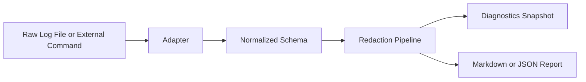

# Zscripts

Zscripts is a structured log collection, normalization, redaction, diagnostics, and reporting toolkit for developers and automation systems.

Public narrative:

> Zscripts converts raw development and CI logs into normalized, redacted, diagnosable, and reportable output through a reusable Python CLI and adapter architecture.

## End-to-End Demonstration

Representative raw log input:

```text
============================= test session starts =============================
FAILED tests/test_services.py::test_generate_report_applies_redaction - AssertionError: API_KEY=sk-live-1234567890abcdef leaked
=========================== short test summary info ===========================
1 failed, 24 passed
```

Normalized output (`python cli.py parse --adapter ci --input examples/raw_to_report/raw.log`):

```json
{
  "tool": "pytest",
  "ecosystem": "python",
  "status": "failed",
  "summary": "No summary provided.",
  "errors": [
    {
      "message": "tests/test_services.py::test_generate_report_applies_redaction - AssertionError: API_KEY=sk-live-1234567890abcdef leaked"
    }
  ]
}
```

Redacted output (`python cli.py redact --input examples/raw_to_report/raw.log`):

```text
... AssertionError: API_KEY=[REDACTED] leaked
```

Generated Markdown report (`python cli.py report --adapter ci --input examples/raw_to_report/raw.log --format markdown --redact --output report.md`):

```markdown
# pytest Report

- **Status:** failed
- **Severity:** error

## Summary
[FAILED] pytest run for python | No summary provided. | Errors: 1
```



## Highlights

- Unified CLI entry point (`python cli.py`) orchestrating collection, parsing,
  reporting, diagnostics, and extension tooling.
- Strictly typed configuration system (`zscripts.config.ToolkitConfig`) with
  support for JSON/TOML files and inline `--set` overrides.
- Observability pipeline with structured logging, Prometheus metrics, and
  diagnostics snapshots suitable for dashboards.
- Automation adapters (`agents/`, `adapters/`) that expose the CLI surface to
  external systems without shelling out.
- Comprehensive pytest suite covering operations, adapters, observability, and
  infrastructure layers.

## Quickstart

Run commands from the repository root. The top-level `cli.py` shim simply
dispatches to `zscripts.cli.main()`, and installed environments also expose
the `zscripts` console command.

```sh
# Inspect the active sandbox guardrails
python cli.py guardrails

# Equivalent installed entry point
zscripts guardrails

# Collect logs from an external command with redaction enabled
python cli.py collect --command pytest --redact

# Parse a log file into the normalised schema
python cli.py parse --input examples/python/sample.log

# Generate a concise summary for the collected log
python cli.py summarize --input examples/python/sample.log

# Produce a detailed explanation of failures and guardrails
python cli.py explain --input examples/python/sample.log

# Generate a Markdown summary and write it to disk
python cli.py report --input examples/python/sample.log --format markdown --output report.md

# Redact sensitive values from collected output using configured patterns
python cli.py redact --input examples/python/sample.log

# Capture diagnostics including metrics and extension inventory
python cli.py diagnostics --include-metrics --format json

# Scaffold a new extension skeleton
python cli.py extensions scaffold demo_extension --directory ./my_extensions

# Discover bundled example logs for each adapter
python cli.py examples --format json

# Inspect supported adapters, descriptions, and sample logs
python cli.py adapters --format json
```

Global flags such as `--config`, `--set`, `--adapter`, `--enable-telemetry`,
`--log-level`, and `--log-format` are available to every command. See
`agents/cli_adapter.py` for a machine-readable description of the surface area.

## Helpers (Legacy and Optional)

The helper collection under `zscripts/helpers` is not part of the strict core
identity and is treated as legacy/optional utility code. It remains
available for compatibility, but the core project scope is adapter-driven log
normalization and diagnostics.

Helper modules are grouped by domain:

- Image processing (`zscripts.helpers.pillow`)
- Web crawling (`zscripts.helpers.web_crawl`)
- Data manipulation (`zscripts.helpers.pandas`)
- And more

Install helpers extras only when needed:

- `pip install .[helpers]`
- `pip install .[helpers-web]`
- `pip install .[helpers-ml]`

Migration note: helper domains should be moved into a dedicated repository over
time. Until migration is complete, they are explicitly optional.

Use the registry system to call helpers by tag:

```python
from zscripts.helpers.registry import call

# Add watermark to image
call("pillow.add_watermark", input_path="img.png", output_path="out.png", text="Demo")
```

## Repository Layout

The root directory intentionally stays small. Consult the README in each folder
for deeper context.

- `adapters/` – Adapter interfaces and language-specific integrations.
- `agents/` – Automation-friendly wrappers that describe the CLI for AI clients.
- `configs/` – Version-controlled configuration defaults (see `configs/README.md`).
- `docs/` – Documentation hub (`docs/INDEX.md` links architecture, automation, and
  planning material).
- `examples/` – Sample projects and captured artifacts used in guides/tests.
- `schemas/` – JSON schema definitions for normalised logs.
- `scripts/` – Developer utilities for scaffolding, diagnostics, and releases.
- `tests/` – Pytest suite mirroring the runtime modules.
- `zscripts/` – Core package containing the CLI, runtime services, extensions,
  and observability infrastructure. Includes `helpers/` for domain-specific Python utilities.

Support and usage references:

- Adapter support matrix: `docs/adapters/SUPPORT_MATRIX.md`
- Raw log to normalized/redacted walkthrough: `docs/guides/RAW_LOG_TO_REDACTED_REPORT.md`
- GitHub Actions usage examples: `docs/guides/GITHUB_ACTIONS_USAGE.md`

Additional governance documents live at the root:

- `SPEC.md` – Repository expectations, maintenance status, and tasking guidance.
- `STYLE-GUIDE.md` – Organisation-wide coding standards.
- `CHANGELOG.md` – Chronological record of notable changes.

## Development Workflow

Create a virtual environment and install the optional tooling extras:

```sh
python -m venv .venv
source .venv/bin/activate
pip install --upgrade pip
pip install .[dev,helpers]  # Add helpers for full functionality
```

Execute the full quality gate with:

```sh
make check  # formatting, lint, mypy, security, pytest
```

Common individual commands:

- `ruff check` / `ruff format` – lint and format the Python codebase.
- `mypy zscripts agents scripts` – static type checks for runtime and automation
  helpers.
- `bandit -q -r zscripts examples/sample_project` / `pip-audit` – security
  checks for code and dependencies.
- `pytest` – run the automated test suite (see `tests/README.md`).
- `python scripts/collect_quality_metrics.py` – emit complexity and dependency metrics.

### One-Command Flows

- `make setup` – bootstrap the environment (falls back to `--skip-install` if
  package installation fails, useful in restricted sandboxes).
- `make dev` – execute the full quality gate defined in `scripts/dev_start.py`.
- `make test` – run the full pytest suite.
- `make build` – build the zipapp bundle at `artifacts/build/zscripts.pyz`.
- `make deploy` – smoke the packaged CLI by running `guardrails` and saving the
  JSON snapshot to `artifacts/build/guardrails.json`.

Operational and quality snapshots are documented in:

- `docs/operations/BASELINE.md` – runtime, automation, and dependency
  inventory.
- `docs/operations/QUALITY_AUDIT.md` – lint/type/test/security/coverage audit
  results and profiling notes.

## Configuration and Extensions

Configuration defaults live in `zscripts/config.py` with a JSON mirror in
`configs/zscripts.config.json`. Supply a TOML or JSON file via
`--config` or pass inline overrides with `--set key=value` pairs. Telemetry can
be toggled per-invocation using `--enable-telemetry`.

Extensions implement `ToolkitExtensionProtocol` from
`zscripts/extensions/base.py`. Use `python scripts/scaffold_module.py extension
<name>` to generate a telemetry-aware skeleton or
`python scripts/scaffold_module.py health <name>` to create a reusable health
check provider. Extension and health-check contributions must follow
`zscripts/extensions/AGENTS.md` and `agents/AGENTS.md`.

## Further Reading

- `docs/architecture/ARCHITECTURE.md` – Component relationships, flows, and
  extension guidance.
- `docs/guides/` – How-to guides for extending adapters and running automation.
- `docs/helpers/LEGACY_OPTIONAL_HELPERS.md` – legacy helper policy and migration plan.
- `docs/releases/RELEASE_NOTES.md` – Narrative release history.
- `docs/SUPPORT.md` / `SECURITY.md` – Support channels and vulnerability reporting.

Keep `TASKLIST.md` updated when work completes and log notable upgrades in
`CHANGELOG.md`.
