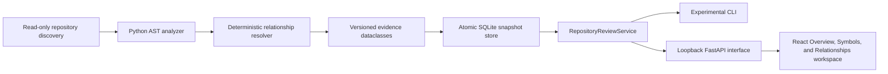

# Architecture Overview

The zscripts toolkit follows a clean architecture that keeps domain concepts,
application orchestration, and infrastructure details isolated.

## Layers

1. **Domain Contracts** (`zscripts.domain.interfaces`, `zscripts.domain.models`)
   - Define protocols for log adapters, sandbox runners, schema validators, and
     repositories.
   - Supply immutable dataclasses that represent sandbox configuration and
     normalized log payloads.
2. **Application Services** (`zscripts.application.services.ToolkitService`)
   - Coordinate adapter resolution, sandbox execution, schema validation, and
     guardrail inspection for both the CLI and embedding automation.
   - Provide reusable methods for collecting, parsing, summarizing, and
     explaining logs so higher layers avoid duplicating orchestration logic.
3. **Infrastructure** (`zscripts.infrastructure.*`, `adapters/`, `scripts/`)
   - Bridge domain protocols to concrete adapters for Python, JavaScript, Go,
     Rust, .NET, Docker, and CI environments.
   - Wrap sandbox execution and redaction helpers with configuration sourced
     from `zscripts.config`.
4. **Interface Layer** (`zscripts.cli`, `cli.py`, `zscripts.interfaces`)
   - Presents a user-friendly CLI with subcommands such as `collect`, `parse`,
     `summarize`, and `guardrails` that reuse the application service layer.

## Repository Review Vertical Slice

The experimental workspace follows the same dependency direction:



- `zscripts.domain.repository_review` owns immutable evidence and version
  contracts.
- `zscripts.infrastructure.repository_discovery`, `python_analyzer`, and
  `relationship_analysis` treat the selected repository as untrusted input,
  never import it, and resolve only deterministic static evidence.
- `zscripts.infrastructure.snapshot_store` persists only completed evidence
  atomically outside the repository. Database schema v2 migrates v1 data
  without reinterpreting old snapshot identities.
- `zscripts.application.repository_review` is the single orchestration/query
  surface used by CLI and API.
- `zscripts.interfaces.workspace_api` is a same-origin, localhost-only transport.
- `workspace-ui` renders evidence; it does not analyze source or construct SQL.

The relationship resolver derives language-neutral graph nodes and immutable
relationship records from one snapshot. Sorted Kosaraju traversal identifies
strongly connected components; deterministic adjacency indexes provide
fan-in/fan-out, inheritance depth, and bounded breadth-first neighborhoods.
Package dependencies are derived from resolved module imports rather than
persisted as a second source of truth.

Generated frontend assets are copied into package data during the quality/build
flow. The existing zipapp remains a lightweight CLI artifact; the workspace is
distributed and smoked through the wheel.

## Legacy Helper Boundary

`zscripts/helpers` is a temporarily wheel-included legacy collection, not a
maintained architecture layer. Maintained application, domain, infrastructure,
observability, extension, schema, adapter, and agent code may not import
`zscripts.helpers` or obsolete top-level `helpers` paths. Phase 2A enforces this
rule statically without importing helper source.

The complete 154-module surface is frozen in
`docs/operations/legacy_helper_surface.json`. Seven registry-exposed modules
receive temporary import/registry compatibility only; the rest remain legacy
and unsupported. Phase 2A changes neither package discovery nor wheel inclusion.
Phase 2B requires a later consumer review and separate owner approval.

## Data Flow

```
CLI / Automation → ToolkitService → AdapterRegistry → Adapter.parse()
                                 ↓                ↘ SchemaValidator.validate()
                           SandboxRunner      Redactor.redact()
                                 ↓
                         Normalized Log Schema
```

1. Users invoke the CLI or call `ToolkitService` directly.
2. The service resolves the adapter via the registry, then either executes a
   sandboxed command, reads from disk, or accepts STDIN to capture raw logs.
3. Adapters parse the logs into the canonical schema; validators enforce the
   contract before responses are returned.
4. Optional redaction masks secrets prior to displaying or writing payloads.

## Design Goals

- **Deterministic behavior**: Schema validation and guardrails prevent silent
  failures when adapters drift from expected output.
- **Extensibility**: New adapters conform to the same protocols and can be
  registered without modifying the service layer.
- **Security-first defaults**: Sandboxing is on by default, with `--dangerous`
  required to disable guardrails.
- **Developer ergonomics**: Both CLI and Python API expose the same
  capabilities, enabling straightforward automation and testing.

## Future Enhancements

- Expand schema validation errors with structured remediation hints.
- Add pluggable metrics hooks so automation can surface parsing durations and
  command exit codes.
- Publish formal adapter lifecycle guidelines and deprecation policies in the
  documentation set.
