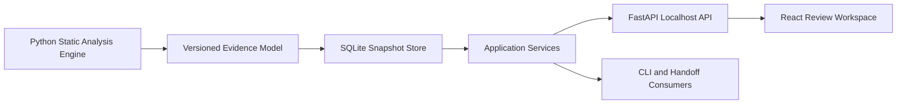

# Zscripts 0.2 Repository Review Workspace Roadmap

Status: approved direction; Phases 1–3 implemented for review under
`PUBLIC BETA — ACTIVE DEVELOPMENT`.

Umbrella issue: #76

## Product definition

Zscripts will become a **local repository review workspace** that maps code
structure, relationships, complexity, architecture, and change without requiring
an LLM or executing the analyzed project.

The product workflow is intentionally small:

```text
Scan → Explore → Review → Compare → Handoff
```

Zscripts is not primarily a report generator, spreadsheet exporter, framework-
specific analyzer, cloud service, coding agent, or repository orchestrator.

The review workspace is the product. Exports are optional views of its evidence.

## User promise

A user selects a local repository and receives a persistent, reviewable workspace
for answering questions such as:

- What packages, modules, classes, functions, methods, and public exports exist?
- Which symbols depend on one another?
- Where are the inheritance, composition, import, containment, and statically
  resolvable call relationships?
- Where are the dependency cycles, high-coupling modules, oversized symbols,
  naming inconsistencies, and duplicate-logic candidates?
- Is the repository a monolith, modular monolith, monorepo, multi-package system,
  plugin architecture, layered system, service-oriented repository, or mixed
  system?
- Which programming paradigms are evidenced by the source?
- What changed between two repository snapshots?
- Which findings have already been reviewed, dismissed, accepted, or resolved?
- What concise evidence should a human or coding agent receive before continuing
  work?

Primary analysis must be deterministic and must not require an LLM. Optional AI
interpretation may be added later as a separate consumer of the evidence, never as
the source of truth.

## Why this remains useful

GitHub connectors and coding agents can inspect remote content, but they do not
replace a local, repeatable workspace for:

- dirty, staged, untracked, ignored, or generated repository state;
- complete symbol and relationship inventories;
- persistent review decisions across scans;
- reproducible architecture and maintainability metrics;
- cross-file naming and duplicate-candidate review;
- private repositories that should not leave the machine;
- local validation evidence;
- before/after architecture comparisons;
- bounded, redacted handoffs.

## Product boundaries

### Core product

- Read-only local repository analysis.
- Versioned, deterministic evidence contracts.
- Local snapshot persistence and comparison.
- Searchable symbol and relationship exploration.
- Explainable metrics and findings.
- Persistent review statuses and annotations.
- Localhost-only review workspace.
- Deterministic handoff generation.
- Optional per-view exports.

### Explicitly outside the initial core

- The legacy `zscripts/helpers` collection.
- Autonomous commits, pushes, merges, releases, or repository mutation.
- Cloud-hosted or multi-tenant analysis.
- LLM-required classification.
- Importing or executing the analyzed project.
- Arbitrary shell execution from repository content.
- Multi-user collaboration.
- Automatic refactoring.
- Excel-first workflows.
- Multiple language analyzers before the Python workflow proves useful.

The helper compatibility work under #62 and #73 is a separate governance track and
must not block this roadmap.

## Product vocabulary

The public product vocabulary should remain consistent:

- **Repository**: a configured local project.
- **Snapshot**: one exact analysis state.
- **Symbol**: a package, module, class, function, method, interface-like construct,
  constant, or public export.
- **Relationship**: a typed, evidenced edge between records.
- **Metric**: a raw deterministic measurement.
- **Finding**: a versioned rule result derived from evidence.
- **Review**: a user decision about a finding.
- **Handoff**: a bounded summary selected from one or more snapshots.

## Core user experience

The workspace has five primary views.

### 1. Overview

The Overview answers:

- What kind of repository is this?
- How large and complex is it?
- How is it organized?
- What are the highest-priority findings?
- What changed since the prior snapshot?

It should show:

- language and manifest detection;
- package/module/symbol counts;
- repository shape and confidence;
- complexity and coupling summaries;
- cycle and hotspot counts;
- test and documentation signals;
- recent snapshot deltas;
- parse gaps, exclusions, truncation, and safety status.

Every conclusion must link to the evidence that produced it.

### 2. Symbols

The Symbols view is the modern replacement for manual class/function reports.

It should support:

- packages and modules;
- classes and interface-like constructs;
- functions and methods;
- signatures, decorators, annotations, and visibility;
- inheritance and containment;
- public exports;
- source file and line;
- complexity and size;
- incoming/outgoing relationships;
- nearby test and documentation evidence.

Required interactions:

- search;
- filter;
- sort;
- group;
- show/hide columns;
- save filters;
- inspect source evidence;
- open related symbols;
- compare a symbol across snapshots.

### 3. Relationships

One relationship workspace should expose switchable graph modes:

- package dependencies;
- module imports;
- class inheritance;
- class composition and type references;
- symbol containment;
- function and method calls where statically resolvable;
- framework-enriched relationships when a later adapter recognizes them.

Large repositories must use progressive disclosure rather than one global graph:

```text
Repository
  └── Package
       └── Module
            └── Class
                 └── Method
```

Users should be able to focus a node, expand a bounded neighborhood, collapse by
package/module, filter edge types, inspect cycles, and view file/line evidence.

Every edge must declare a resolution status such as:

- `resolved-static`;
- `probable-static`;
- `ambiguous`;
- `unresolved-dynamic`.

### 4. Findings

The Findings view is a persistent review queue, not a regenerated warning list.

Initial finding families:

- dependency cycles;
- naming inconsistencies;
- duplicate symbol names;
- duplicate-logic candidates;
- oversized functions, classes, and modules;
- high complexity;
- high fan-in or fan-out;
- deep inheritance;
- low-cohesion candidates;
- suspicious cross-boundary imports;
- undocumented public symbols;
- high-complexity symbols without nearby test evidence;
- orphan or dead-looking candidates, clearly labeled as candidates.

Review states:

```text
New
Reviewed
Needs action
Accepted
Dismissed
Resolved
```

A finding must include:

- rule and rule-set version;
- severity and confidence;
- evidence and affected symbols;
- explanation and possible next action;
- first-seen and last-seen snapshots;
- review status and notes.

Finding evidence and user review state must be stored separately so decisions can
persist across repeated scans.

### 5. Handoff

The Handoff view lets a user choose what to include:

- repository state;
- architecture evidence;
- important symbols;
- recent changes;
- selected findings;
- dependency cycles;
- complexity hotspots;
- validation results;
- selected files;
- task objective;
- unresolved analysis gaps.

Supported actions:

- preview;
- copy to clipboard;
- save as a handoff record;
- export concise Markdown;
- export structured JSON.

The handoff is one view of the evidence, not the product itself.

## Local data model

Use SQLite for the initial application store.

```text
Application database
├── repositories
├── snapshots
├── files
├── modules
├── symbols
├── relationships
├── metrics
├── findings
├── finding_reviews
├── annotations
├── comparisons
└── handoffs
```

The application database and caches must live outside analyzed repositories.
Analyzed repositories remain unchanged unless the user explicitly exports to a
chosen path.

### Repository record

- canonical local path;
- display name;
- source-control metadata;
- language/manifests summary;
- analysis configuration;
- last analysis state.

### Snapshot record

- branch and Git SHA when available;
- dirty/staged/untracked state;
- analyzer, schema, and rule-set versions;
- configuration and exclusion digest;
- source fingerprint;
- start/completion/cancellation state;
- resource usage and timing;
- parse gaps and truncation evidence.

A failed or cancelled scan must never appear as complete.

### Symbol record

- stable identifier;
- language and kind;
- qualified and display names;
- file and source range;
- parent symbol;
- visibility;
- signature and annotations;
- decorators;
- documentation status;
- complexity and size;
- content fingerprint.

### Relationship record

- source and target IDs;
- relationship type;
- evidence and source location;
- confidence and resolution status;
- analyzer and adapter version.

### Finding record

A deterministic rule output separate from the user review record.

## Analysis pipeline

```text
Repository discovery
        ↓
Safe file inventory
        ↓
Language detection
        ↓
Language analyzer
        ↓
Symbol resolution
        ↓
Relationship graphs
        ↓
Metrics
        ↓
Findings
        ↓
Architecture classification
        ↓
Atomic snapshot persistence
```

### Repository discovery

Detect:

- Git root and worktree state;
- source, test, package, and workspace roots;
- manifests and language evidence;
- generated/build/cache directories;
- ignored files;
- binaries and oversized files;
- configured exclusions.

Default exclusions include:

- `.git` internals;
- `.env*` and common credential/key files;
- virtual environments and dependency caches;
- build outputs and generated artifacts;
- ignored files unless explicitly included;
- binaries and files exceeding configured limits.

Every exclusion must be represented by a non-sensitive reason.

### Initial language analyzer

The first analyzer is **generic Python**, not Django-specific.

Extract statically:

- modules and packages;
- classes and nested classes;
- functions, async functions, methods, and nested functions;
- signatures, annotations, decorators, docstrings, visibility, and source ranges;
- assignments and constants where useful;
- imports, aliases, relative imports, and public exports;
- inheritance and class references;
- calls and instantiations where resolvable;
- abstract methods, protocols, dataclasses, enums, and common framework markers.

Framework adapters may later enrich generic evidence for Django, FastAPI, Flask,
SQLAlchemy, Pydantic, pytest, Click, Typer, or other demonstrated needs. No
framework should define the core product.

### Resolution policy

Static Python resolution is incomplete. Zscripts must distinguish resolved,
probable, ambiguous, dynamic, and unresolved relationships instead of presenting
all edges as facts.

### Incremental analysis

Cache by:

- file content hash;
- analyzer version;
- schema version;
- rule-set version;
- relevant configuration digest.

Only affected files and dependent graph sections should be recomputed when safe.

## Metrics and findings

### Raw metrics

- files, lines, packages, modules, classes, functions, methods, and exports;
- cyclomatic and cognitive complexity;
- nesting and parameter counts;
- symbol/module size distributions;
- internal and external dependencies;
- fan-in, fan-out, and instability;
- cohesion proxies;
- inheritance depth and breadth;
- abstract/concrete and public/private ratios;
- documentation and test-proximity signals;
- Git change concentration when available.

### Naming review

Detect:

- duplicate class/function names;
- similar names for apparently overlapping concepts;
- inconsistent abbreviations and synonyms;
- generic names;
- naming-convention deviations;
- terminology drift across packages.

### Duplicate-logic candidates

Use deterministic static techniques such as:

- normalized AST fingerprints;
- structural/control-flow shape;
- signature similarity;
- called-symbol overlap;
- imported-dependency overlap;
- token shingles or locality-sensitive hashes.

These are review candidates, never proof of semantic duplication.

### Repository classification

Possible evidence-backed classifications:

- single-package application;
- modular monolith;
- monorepo or multi-package repository;
- plugin-oriented architecture;
- layered architecture;
- service-oriented repository;
- library/tool/application mixture;
- mixed;
- unknown.

Every classification must include confidence, supporting rules, contradictory
evidence, and an `unknown` or `mixed` outcome when evidence is insufficient.

### Programming-paradigm indicators

Report relative evidence for:

- object-oriented;
- procedural;
- functional;
- event-driven;
- declarative/configuration-driven;
- dependency-injection oriented;
- data/domain-model oriented.

These indicators describe source evidence, not developer intent.

## View-first exports

Default behavior:

```text
Analyze → Store snapshot → Open workspace
```

Do not generate a report bundle after every scan.

Optional per-view exports:

- visible symbol table to CSV;
- selected findings to Markdown or JSON;
- focused graph to SVG/PNG/GraphML;
- snapshot evidence to JSON;
- handoff to clipboard, Markdown, or JSON.

XLSX may be added later if dogfooding demonstrates real value. It must not drive
the architecture or block the MVP.

## Runtime architecture



Architectural rules:

- The engine does not know about React.
- The UI never reimplements analysis.
- CLI and UI use the same application services.
- Repository-derived text is escaped and bounded.
- The analyzed repository is input, never an importable plugin.
- Analysis data is committed atomically to the local store.

### Local runtime

The intended command is:

```text
zscripts workspace
```

It should:

1. bind to `127.0.0.1` by default;
2. serve the API and built UI from one local process;
3. open the browser;
4. store data in the user application-data directory;
5. make no ordinary outbound network request.

No Docker, Redis, external database, or cloud account is required for the MVP.
Tauri packaging may be evaluated only after the local web workflow is stable.

## Public and private-input safety

Cross-cutting issue: #82

### Analysis safety

- Never import analyzed modules.
- Never execute analyzed repository scripts.
- Never invoke framework setup, migrations, hooks, or plugins.
- Never make network calls based on analyzed code.
- Never write into the analyzed repository by default.
- Never follow symlinks outside allowed roots without explicit permission.

### Privacy

- Honor `.gitignore` and configured exclusions.
- Exclude likely secrets and credentials by default.
- Support metadata-only scans with no source excerpts.
- Bound any stored source evidence.
- Redact paths, secrets, emails, tokens, and organization-specific values from
  exports.
- Never commit private-repository source or identifying local paths as fixtures.

### Resource controls

- file-count, file-size, and total-byte limits;
- node and edge limits;
- runtime and memory budgets;
- progress and cancellation;
- explicit partial/truncated status;
- cancellation-safe cache and snapshot handling.

### Public API discipline

- New commands and routes remain experimental until approved.
- Schemas and rules are versioned.
- Golden fixtures and malicious-input tests precede stable claims.
- Existing `quality` remains the only required GitHub status context.
- No stable tag, release, or package publication during the MVP.

## Vertical delivery plan

The roadmap is delivered through complete, reviewable vertical slices rather than
large disconnected subsystems.

### Phase 0 — product contracts and safety

Issues: #76 and #82

Deliver:

- final public product narrative;
- information architecture for the five views;
- evidence and snapshot contracts;
- finding/review-state contracts;
- privacy, exclusion, and resource-limit policies;
- experimental API policy;
- purpose-built safe fixtures.

No broad runtime implementation.

### Phase 1 — Repository Review MVP

Issue: #77

Deliver end to end:

- select/configure a local repository;
- safe generic-Python discovery and AST extraction;
- SQLite repository and snapshot persistence;
- thin FastAPI backend;
- thin React shell;
- Overview view;
- Symbols view;
- search, filter, sort, and source evidence;
- progress, cancellation, and parse diagnostics;
- reopen prior snapshots;
- CLI and UI evidence equivalence.

Exit criteria:

- useful generic Python repository scan;
- no analyzed code imports or writes;
- byte-identical core evidence from unchanged input;
- completed snapshots persisted atomically;
- user can review symbols in the local workspace.

### Phase 2 — Relationships

Issue: #78

Status: implemented for review.

Deliver:

- package/module imports;
- class inheritance;
- containment;
- cycle detection;
- focused graph explorer;
- source evidence panel;
- bounded neighborhood expansion.

Do not begin with a complete function call graph. Add call relationships later as
resolution quality improves.

### Phase 3 — Findings and review workflow

Issue: #79

Status: implemented for review in the `feature/repository-findings` vertical
slice; publication remains gated on exact-head hosted quality.

Deliver:

- first high-value deterministic findings;
- finding statuses and notes;
- first/last seen tracking;
- naming drift and duplicate-name review;
- size, complexity, coupling, cycle, inheritance, documentation, and test signals;
- initial normalized-AST duplicate candidates.

### Phase 4 — deeper calls and architecture analysis

Issues: #78 and #79

Deliver:

- statically resolvable call edges;
- explicit ambiguous/unresolved call evidence;
- cohesion proxies;
- repository shape classification;
- paradigm indicators;
- architecture-boundary rules;
- explainable confidence and contradictory evidence.

### Phase 5 — snapshot comparison and handoffs

Issue: #80

Deliver:

- [x] conservative file, symbol, relationship, cycle, metric, and
  finding-occurrence deltas;
- [x] explicit version/partial-evidence compatibility;
- [x] bounded deterministic handoff selection and local saved records;
- [x] explicit review-note opt-in, clipboard, and Markdown/JSON downloads.

Architecture heuristics remain in #94. Generic selected-view exports remain in
#96. This phase does not infer semantic renames or architecture drift.

### Phase 6 — framework enrichment

Add framework adapters only where actual dogfooding demonstrates value. Generic
Python remains the core analyzer.

### Phase 7 — polish and dogfood

Issue: #83

Improve:

- large table and graph performance;
- saved filters;
- keyboard navigation and accessibility;
- responsive layouts;
- source previews;
- progress and cancellation;
- selected-view exports;
- installation workflow.

Dogfood against purpose-built public fixtures and sanitized aggregate evidence.

### Phase 8 — additional languages

Only after the Python workspace proves useful. Recommended evaluation order:

1. TypeScript/JavaScript;
2. Rust;
3. C#;
4. Go or Java according to demonstrated demand.

All analyzers must emit the same language-neutral evidence model.

## GitHub execution model

Because the repository is public-facing:

- one focused issue per PR;
- draft PRs until exact-head `quality` passes;
- squash merges only;
- no long-lived implementation branch;
- no helper cleanup mixed with product development;
- no private repository evidence committed;
- schema and safety changes reviewed with the vertical slice that first uses them;
- rendered UI review required for user-facing changes;
- no release, tag, or package publication during the MVP.

## MVP completion gate

The first product milestone is complete only when a user can:

1. start Zscripts locally;
2. select an ordinary Python repository;
3. analyze it without executing or modifying it;
4. view packages, modules, classes, functions, and methods;
5. search, filter, sort, and inspect source evidence;
6. inspect imports, inheritance, containment, and cycles;
7. review deterministic metrics and findings;
8. mark findings reviewed, accepted, dismissed, or resolved;
9. rescan and compare snapshots;
10. generate a bounded handoff;
11. reproduce the same evidence from unchanged source;
12. confirm ordinary use sends no repository data outside localhost.

## Immediate next action

1. Review the #77 MVP implementation and rendered desktop/mobile workspace.
2. Merge only after the exact-head hosted `quality` context succeeds.
3. Dogfood Overview, Symbols, source evidence, cancellation, and prior snapshots
   against public or purpose-built fixtures.
4. Begin #78 Relationships only after MVP review confirms the evidence and
   interaction contracts.

Do not start with a standalone export engine, framework-specific analyzer, or
late-stage dashboard. The fastest credible path is one small end-to-end local
workspace that proves the product workflow.
