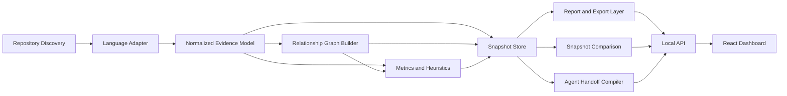

# Zscripts 0.2 Repository Intelligence Roadmap

Status: proposed product direction for `PUBLIC BETA — ACTIVE DEVELOPMENT`.

Umbrella issue: #76

## Product decision

Zscripts will become a **local, deterministic repository intelligence, reporting,
visualization, and agent-handoff tool**.

The core product must answer questions such as:

- What modules, classes, methods, and functions exist?
- Where are names, responsibilities, or logic duplicated?
- Which modules, classes, and functions depend on one another?
- What inheritance, composition, call, import, and framework relationships exist?
- Where are the dependency cycles, high-coupling modules, god classes, and
  architectural boundary violations?
- Is the repository a monolith, modular monolith, monorepo, multi-package system,
  plugin architecture, library, application, or mixed system?
- Which programming paradigms are evidenced by the source?
- How has the architecture changed between two snapshots?
- What compact evidence should a human or coding agent receive before continuing
  work?

The primary analysis must not require an LLM. Optional AI interpretation may be
added later as a consumer of deterministic evidence, never as the source of truth.

## Why this remains useful

GitHub connectors and coding agents can inspect remote repository content, but they
still do not replace deterministic local evidence for:

- dirty, staged, untracked, ignored, or generated state;
- installed local toolchains and local validation results;
- complete symbol and relationship inventories;
- reproducible architecture metrics;
- cross-file naming and duplication review;
- local/private repository analysis;
- spreadsheet review;
- bounded, redacted handoff packages;
- before/after repository comparisons.

Zscripts should provide this evidence consistently to humans, local workflow
orchestrators, GitHub coordination workflows, and coding agents.

## Product boundaries

### Core product

- Read-only local repository analysis.
- Deterministic, versioned evidence schemas.
- Static source analysis with explicit confidence and limitations.
- Symbol, dependency, inheritance, call, and containment graphs.
- Architecture, modularity, paradigm, naming, complexity, and maintainability
  metrics.
- Repository snapshots and snapshot comparison.
- JSON, Markdown, CSV, XLSX, GraphML, and bounded Mermaid exports.
- Deterministic human and agent handoffs.
- Localhost-only API and dashboard.

### Explicitly outside the core

- The legacy `zscripts/helpers` collection.
- Autonomous commits, pushes, merges, releases, or remote repository mutation.
- Cloud-hosted multi-tenant analysis.
- Analysis that imports or executes the target project.
- LLM-required classification.
- Arbitrary shell execution from analyzed repository content.

The helper compatibility work under #62 and #73 is a separate governance track and
must not block this roadmap.

## Fastest safe delivery strategy

Build **vertical slices** that produce user-visible value early, while preserving a
single deterministic evidence model.

Do not build a large UI before the engine and schemas are trustworthy. Do not build
multiple language analyzers before the Python/Django workflow is useful.

The first valuable slice should:

1. analyze a Python/Django repository without importing it;
2. list modules, classes, functions, methods, signatures, and locations;
3. report imports, inheritance, and resolvable calls;
4. calculate a small set of documented metrics;
5. export JSON, Markdown, XLSX, and GraphML;
6. generate a concise handoff;
7. remain experimental and read-only.

## Target architecture



### Architectural rules

- `domain`: immutable evidence records and graph contracts.
- `application`: repository analysis, comparison, export, and handoff use cases.
- `infrastructure`: filesystem, Git, caching, parser adapters, and exporters.
- `interfaces`: CLI, local API, and UI.
- Language-specific logic must be behind adapter protocols.
- UI code must consume application contracts rather than reimplement analysis.
- The analyzed repository is an input, never an importable plugin.

## Evidence model

Every artifact must record:

- schema version;
- analyzer version;
- rule-set version;
- repository identity;
- branch and Git SHA when available;
- dirty-state evidence;
- configuration and exclusion policy digest;
- start/completion status;
- truncation and parse-gap diagnostics;
- redaction metadata;
- source file hashes;
- deterministic node and relationship identifiers.

Primary records:

- `RepositorySnapshot`
- `ProjectRecord`
- `FileRecord`
- `ModuleRecord`
- `SymbolRecord`
- `RelationshipRecord`
- `MetricRecord`
- `FindingRecord`
- `DiagnosticRecord`
- `ReportManifest`

Relationship records must contain an evidence classification such as:

- `resolved-static`
- `probable-static`
- `ambiguous`
- `unresolved-dynamic`

Static limitations must never be hidden behind confident prose.

## Python and Django MVP

Issue: #77

### Repository discovery

- Respect Git tracked files, `.gitignore`, configured excludes, and default
  sensitive/generated directories.
- Record every excluded path with a non-sensitive reason.
- Enforce file-count, file-size, total-byte, and runtime limits.
- Support cancellation and partial results.
- Cache by file hash, analyzer version, and configuration digest.

### Python symbols

Extract without importing source:

- modules and packages;
- classes and nested classes;
- functions, async functions, methods, and nested functions;
- signatures, annotations, decorators, docstrings, visibility, and source ranges;
- assignments and constants where useful;
- imports, relative imports, aliases, and public re-exports;
- abstract methods, protocols, dataclasses, enums, and common framework markers.

### Django evidence

Identify statically:

- Django apps;
- models and declared fields;
- model inheritance and relationships;
- views and view classes;
- forms and serializers;
- URL patterns and included URL modules;
- admin registrations;
- signals and receivers;
- management commands;
- settings modules;
- migrations as a separate evidence category.

The analyzer must not call `django.setup()`, import settings, connect to databases,
or execute migrations.

## Graph model

Issue: #78

Required graphs:

- module import graph;
- package dependency graph;
- symbol containment graph;
- class inheritance graph;
- class composition/reference graph;
- function and method call graph;
- Django model relationship graph;
- URL-to-view graph;
- signal-to-receiver graph where statically evident.

Required graph analysis:

- strongly connected components;
- circular imports and dependency cycles;
- fan-in and fan-out;
- hubs, leaves, orphans, and bridge nodes;
- inheritance depth and breadth;
- cross-package and cross-layer edges;
- graph reduction by package, module, class, and neighborhood depth.

Graph outputs:

- deterministic JSON;
- GraphML;
- bounded Mermaid;
- UI-ready node/edge payloads.

## Metrics and classification

Issue: #79

### Raw metrics

- files, lines, modules, packages, classes, functions, methods, and exports;
- cyclomatic and cognitive complexity;
- symbol and module size distributions;
- internal/external dependency counts;
- fan-in/fan-out and instability;
- cohesion and coupling proxies;
- inheritance depth and breadth;
- abstract/concrete and public/private ratios;
- documentation and test proximity;
- Git change concentration where available.

### Naming and duplication

- duplicate names in different scopes;
- overloaded concepts and inconsistent synonyms;
- naming convention violations and outliers;
- excessively generic names;
- normalized AST fingerprints for duplicate-logic candidates;
- similar signatures and class shapes;
- repeated dependency patterns.

Duplicate-logic output is a review candidate, not proof of semantic duplication.

### Repository shape

Classify with evidence and confidence:

- single-package monolith;
- modular monolith;
- monorepo or multi-package repository;
- plugin/extension architecture;
- layered architecture;
- service-oriented repository;
- library/tool/application mixture;
- unknown or mixed.

### Paradigm indicators

Report evidence for:

- object-oriented;
- functional;
- procedural;
- event-driven;
- declarative/configuration-driven;
- dependency-injection oriented;
- data/domain-model oriented.

Every classification must expose supporting rules, contradictory evidence, and
confidence. No rule may claim to understand intent beyond the source evidence.

## Reports, spreadsheets, comparisons, and handoffs

Issue: #80

A complete report bundle should include:

```text
report/
├── manifest.json
├── repository.json
├── symbols.json
├── relationships.json
├── metrics.json
├── findings.json
├── report.md
├── report.xlsx
├── handoff.md
├── graph.graphml
└── diagrams/
```

### Excel workbook

Sheets:

- Overview
- Modules
- Classes
- Functions and Methods
- Public Exports
- Inheritance
- Calls and Dependencies
- Cycles
- Complexity
- Naming Findings
- Duplicate Candidates
- Architecture Findings
- Django Apps, Models, Views, and URLs
- Diagnostics and Exclusions

Workbook requirements:

- stable row ordering;
- filters and frozen headers;
- useful widths and source-path hyperlinks;
- no macros or executable content;
- exact SHA and schema metadata;
- truncation notices;
- redaction across cells and hyperlinks.

### Snapshot comparison

Compare two snapshots or Git refs for:

- files and symbols added, removed, or changed;
- signature, inheritance, and public export changes;
- dependency and cycle changes;
- metric deltas;
- architecture classification changes;
- new and resolved findings.

### Agent handoff

Generate a bounded handoff with:

- repository identity and state;
- architecture summary with evidence;
- important symbols and dependency hubs;
- baseline changes;
- validation evidence;
- parse gaps and uncertainty;
- relevant paths and suggested next commands;
- links to supporting artifacts.

The handoff must remain useful without an LLM and easy for an LLM or workflow
orchestrator to consume.

## Local dashboard

Issue: #81

Recommended first implementation:

- FastAPI localhost backend;
- TypeScript/React frontend;
- shared versioned evidence contracts;
- bind to `127.0.0.1` by default;
- no cloud dependency or ordinary outbound network request;
- optional Tauri packaging only after the local web workflow is stable.

Primary screens:

1. repository picker and recent snapshots;
2. repository overview and classification;
3. symbol explorer;
4. dependency graph explorer;
5. inheritance and class relationship explorer;
6. metrics and findings;
7. Django architecture view;
8. snapshot comparison;
9. report/export center;
10. handoff preview.

Large graphs require aggregation, filtering, node limits, and explicit truncation.

## Public-repository and private-input safety

Issue: #82

### Analysis safety

- Static parsing only in the MVP.
- Never import analyzed modules.
- Never run repository hooks, migrations, framework setup, or project commands.
- Never write into the analyzed repository unless a user explicitly selects an
  export path.
- Use atomic output writes and cancellation-safe caches.

### Privacy

Default exclusions include:

- `.env` and common secret files;
- key stores and credentials;
- `.git` internals;
- dependency caches and virtual environments;
- build outputs and generated artifacts;
- ignored files unless explicitly included.

Support a metadata-only mode with no source snippets. Apply redaction consistently
to JSON, Markdown, Excel, GraphML, UI payloads, and handoffs.

### Resource limits

- maximum files;
- maximum file size;
- maximum total bytes;
- maximum nodes and edges;
- maximum relationship depth;
- runtime and memory budgets;
- progress and cancellation;
- explicit partial/truncated status.

### Public API discipline

- New commands remain under `experimental` until approved.
- Schemas and rules are versioned.
- Golden fixtures and compatibility tests precede stable claims.
- Existing `quality` remains the single required status context.

## Dogfooding and language expansion

Issue: #83

Prove value on representative Python/Django repositories before adding languages.
Evaluate:

- whether symbol inventory prevents duplicate concepts and naming drift;
- usefulness of inheritance and dependency graphs;
- accuracy and explainability of modularity/paradigm findings;
- value of the Excel workbook;
- reduction in agent clarification requests;
- false-positive rates;
- performance and graph-size limits.

Only sanitized aggregate evidence or purpose-built public fixtures may enter this
public repository.

After Python contracts stabilize, add language adapters in this likely order:

1. TypeScript/JavaScript;
2. Rust;
3. C#;
4. Go or Java based on demonstrated repository demand.

All adapters must emit the same language-neutral evidence schema.

## Ordered implementation slices

### Slice 0 — product and safety contract

Issues: #76 and #82

- Approve schemas, safety rules, experimental namespace, fixture policy, and
  performance budgets.
- No user-visible runtime behavior changes beyond experimental scaffolding.

Exit criteria:

- reviewed architecture and schemas;
- malicious/sensitive fixtures defined;
- public-beta documentation accurate.

### Slice 1 — deterministic Python symbol inventory

Issue: #77

- repository discovery;
- Python AST extraction;
- stable records and JSON output;
- Django fixture;
- cache and parse diagnostics.

Exit criteria:

- useful symbol report from a Django fixture;
- byte-identical repeat analysis;
- no project imports or writes.

### Slice 2 — first useful report

Issues: #77 and a narrow portion of #80

- Markdown summary;
- symbol/module CSV or XLSX sheets;
- deterministic handoff draft.

This intentionally ships before the full graph UI so the product becomes useful
early.

### Slice 3 — dependency and inheritance graphs

Issue: #78

- imports, inheritance, containment, resolvable calls;
- cycles and graph metrics;
- JSON, GraphML, and bounded Mermaid.

### Slice 4 — architecture and duplication findings

Issue: #79

- coupling/cohesion, complexity, naming, duplicate candidates;
- repository shape and paradigm evidence.

### Slice 5 — complete export and comparison layer

Issue: #80

- full Excel workbook;
- snapshot comparison;
- production-quality bounded handoff compiler.

### Slice 6 — localhost dashboard

Issue: #81

- local API;
- React dashboard;
- interactive graphs and export workflow.

### Slice 7 — dogfood and next-language decision

Issue: #83

- measured evaluation;
- performance budgets;
- false-positive review;
- approve TypeScript only if Python MVP proves value.

## PR and branch strategy

Because the repository is public-facing:

- one focused issue per PR;
- draft PRs until exact-head `quality` passes;
- squash merges only;
- no long-lived implementation branch;
- experimental namespace for new commands;
- schema and fixture changes reviewed before UI changes;
- no helper cleanup mixed with repository-intelligence work;
- no version tag, release, or package publication during the MVP.

Recommended first implementation branch after this roadmap merges:

```text
feature/repository-analysis-schema
```

Recommended first implementation issue: #77, with #82 safety tests included in the
same initial vertical slice where necessary.

## MVP completion gate

The MVP is complete only when a user can:

1. select a Python/Django repository;
2. analyze it without importing or changing it;
3. review classes, functions, methods, modules, imports, inheritance, and calls;
4. see documented metrics and architecture findings;
5. explore a dependency graph;
6. export JSON, Markdown, Excel, and GraphML;
7. compare two snapshots;
8. generate a deterministic agent handoff;
9. perform the same workflow through a localhost UI;
10. reproduce the same evidence on an unchanged repository.

## Immediate next action

After this roadmap is reviewed and merged, begin #77 with a schema-and-fixtures PR.
Do not begin the React dashboard first. The fastest route to a credible product is
a trustworthy Python/Django evidence engine followed immediately by a simple
Excel/report vertical slice.
